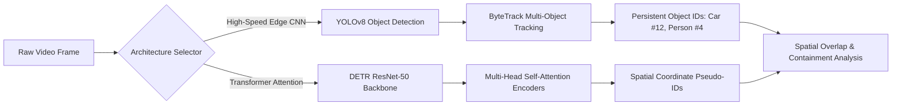
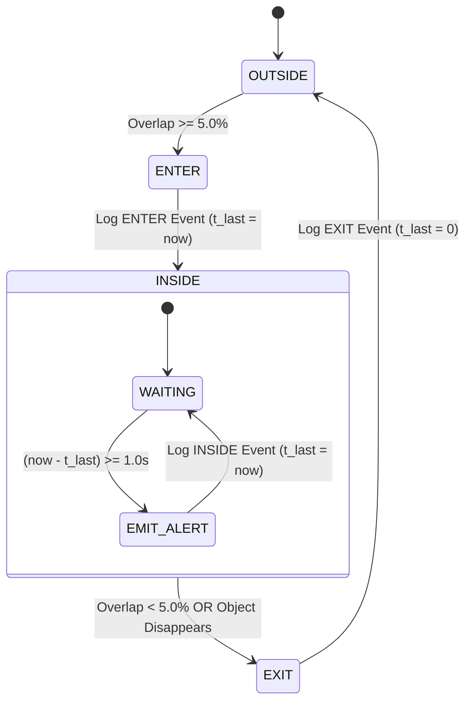

# 📹 Multi-Model AI Surveillance & Red Zone ID Tracking Platform

[](https://www.python.org/)
[](https://pytorch.org/)
[](https://ultralytics.com)
[](https://huggingface.co/facebook/detr-resnet-50)
[](https://opencv.org/)
[](https://flask.palletsprojects.com/)
[](LICENSE)

> **A Real-Time Industrial Computer Vision Guardrail Platform featuring Persistent Multi-Object ID Tracking (MOT), Interactive Vector Polygon Red Zones, $\ge 5\%$ Bounding-Box Overlap Detection, Entry/Exit State Transitions, and Anti-Spam Telemetry Logging.**

---

## 📑 Table of Contents
- [1. Executive Overview & Problem Statement](#1-executive-overview--problem-statement)
- [2. System Architecture](#2-system-architecture)
- [3. Deep Learning & Tracking Engine](#3-deep-learning--tracking-engine)
- [4. Mathematical Formulations & Algorithms](#4-mathematical-formulations--algorithms)
  - [4.1 Bounding-Box $\cap$ Polygon Overlap Engine](#41-bounding-box-cap-polygon-overlap-engine)
  - [4.2 Per-Object 1-Second Alert Throttling State Machine](#42-per-object-1-second-alert-throttling-state-machine)
  - [4.3 Responsive Viewport Coordinate Transformation](#43-responsive-viewport-coordinate-transformation)
- [5. Platform Features](#5-platform-features)
- [6. Directory Layout](#6-directory-layout)
- [7. Installation & Quick Start](#7-installation--quick-start)
- [8. API Reference](#8-api-reference)
- [9. Performance & Benchmarks](#9-performance--benchmarks)
- [10. Authors & Acknowledgments](#10-authors--acknowledgments)

---

## 1. Executive Overview & Problem Statement

Conventional CCTV monitoring pipelines suffer from critical operational limitations:
1. **Passive Observation & Human Fatigue:** Human attention drops significantly after 20 minutes of continuous surveillance.
2. **Rigid Rectangular Filters:** Standard motion detection tools use bounding rectangles that cannot model angular walkways, diagonal road lanes, perimeter fencing, or complex industrial machinery zones.
3. **Point-Based Spatial Inaccuracy:** Simple bottom-anchor or centroid tests fail when large vehicles or personnel partially cross hazardous perimeters.

### The Solution:
This platform introduces an **interactive spatial guardrail framework** that combines **YOLOv8 ByteTrack multi-object tracking** and **DETR Global Attention Transformers** with a raster-accurate **$\ge 5\%$ bounding-box/polygon intersection engine**. Operators draw custom vector polygonal zones directly on top of the live stream, generating instantaneous `ENTER`, steady 1-second `INSIDE`, and clean `EXIT` telemetry without camera disruption.

---

## 2. System Architecture

```mermaid
graph TD
    subgraph Client ["Browser Frontend (HTML5 Canvas + CSS Glassmorphism)"]
        UI[Interactive UI Controls]
        Canvas[HTML5 Canvas Polygon Overlay]
        Stream[MJPEG Video Feed Stream]
        Polling[REST Polling Client: /status every 500ms]
    end

    subgraph Backend ["Flask WSGI Web Application (app.py)"]
        Routes[API Endpoints: /set_roi, /clear_roi, /status, /config]
        StreamGen[MJPEG Frame Generator: generate_frames]
        Lifecycle[Thread-Safe Camera Manager: start/stop]
    end

    subgraph Engine ["Surveillance & Analytics Engine (surveillance.py)"]
        Capture[OpenCV cv2.VideoCapture]
        ModelYOLO[YOLOv8 CNN Object Detector + ByteTrack MOT]
        ModelDETR[DETR ResNet-50 Transformer Backbone]
        MaskEngine[OpenCV Polygon Mask Generator cv2.fillPoly]
        OverlapEngine[Bbox ∩ Polygon Pixel Intersection Engine]
        StateMachine[Per-Object Alert State Machine 1s Throttling]
        Logger[Throttled Event Logger -> alerts.log]
        Alarm[Asynchronous Audio Alert winsound]
    end

    Canvas -->|POST /set_roi (Normalized Coords)| Routes
    Capture --> StreamGen
    StreamGen --> Engine
    ModelYOLO --> OverlapEngine
    ModelDETR --> OverlapEngine
    MaskEngine --> OverlapEngine
    OverlapEngine --> StateMachine
    StateMachine --> Logger
    StateMachine --> Alarm
    StateMachine --> StreamGen
    StreamGen -->|multipart/x-mixed-replace| Stream
    Routes --> Polling
    Polling --> UI
```

---

## 3. Deep Learning & Tracking Engine

The platform implements dual-architecture support, allowing users to toggle between high-speed CNN tracking and global-attention transformer inference:



1. **Ultralytics YOLOv8 (Primary Mode):**
   - Anchor-free convolutional detection head with cross-stage partial network (CSPDarknet53).
   - Integrated with **ByteTrack MOT (Multi-Object Tracking)** to maintain persistent track IDs across occlusions and dynamic camera motion.
2. **Hugging Face DETR (Transformer Mode):**
   - End-to-end object detection with Transformer encoders and decoders (`facebook/detr-resnet-50`).
   - Eliminates hand-designed anchor boxes and non-maximum suppression (NMS) in favor of direct bipartite matching.

---

## 4. Mathematical Formulations & Algorithms

### 4.1 Bounding-Box $\cap$ Polygon Overlap Engine

Rather than testing whether a single centroid $P(x_c, y_c)$ falls inside a polygon, the engine performs pixel-accurate geometric intersection:

$$\text{Overlap Ratio} = \frac{\text{Area}(\text{BoundingBox} \cap \text{Polygon})}{\text{Area}(\text{BoundingBox})} = \frac{\sum_{(x,y) \in \text{BBox}} \mathbf{M}_{\text{poly}}(x, y)}{\text{Width}_{\text{bbox}} \times \text{Height}_{\text{bbox}}}$$

$$\text{Violation State} = \begin{cases} \mathbf{TRUE} \quad (\text{Red Zone Breach}), & \text{Overlap Ratio} \ge 0.05 \quad (5.0\%) \\ \mathbf{FALSE} \quad (\text{Secure Zone}), & \text{Overlap Ratio} < 0.05 \end{cases}$$

```mermaid
flowchart TD
    A[Frame Captured: W x H] --> B[Generate Binary Polygon Mask M_poly via cv2.fillPoly]
    C[YOLO Returns Bbox: x1, y1, x2, y2] --> D[Extract Sub-region: M_poly_roi = M_poly[y1:y2, x1:x2]]
    B --> D
    D --> E[Count Non-Zero Pixels: cv2.countNonZero]
    E --> F[Compute: Overlap = NonZero / Bbox_Pixels]
    F --> G{Overlap >= 5.0% ?}
    G -->|Yes| H[Flag Red Zone Violation -> Render Red Bbox]
    G -->|No| I[Standard Green Track Bbox]
```

### 4.2 Per-Object 1-Second Alert Throttling State Machine

To prevent log flooding while maintaining high-frequency telemetry, each object $i$ maintains an independent state machine per zone:



### 4.3 Responsive Viewport Coordinate Transformation

To guarantee that mouse clicks on responsive web viewports map to raw video pixels:

$$\text{RenderWidth} = \begin{cases} \text{ContainerWidth}, & \text{Aspect}_{\text{video}} > \text{Aspect}_{\text{container}} \\ \text{ContainerHeight} \times \text{Aspect}_{\text{video}}, & \text{otherwise} \end{cases}$$

$$\text{RenderHeight} = \begin{cases} \frac{\text{ContainerWidth}}{\text{Aspect}_{\text{video}}}, & \text{Aspect}_{\text{video}} > \text{Aspect}_{\text{container}} \\ \text{ContainerHeight}, & \text{otherwise} \end{cases}$$

$$\text{Frame}_X = \text{round}\left( \frac{\text{Click}_X - \text{Offset}_X}{\text{RenderWidth}} \times \text{NativeWidth} \right), \quad \text{Frame}_Y = \text{round}\left( \frac{\text{Click}_Y - \text{Offset}_Y}{\text{RenderHeight}} \times \text{NativeHeight} \right)$$

---

## 5. Platform Features

| Feature | Description |
|---|---|
| 🔴 **Interactive Red Zones** | Click unlimited polygon nodes on the live canvas overlay; confirmed zones render directly on video frames. |
| 🔄 **Non-Disruptive Drawing** | Webcam and model inference run continuously while drawing, confirming, or modifying zones. |
| 🎯 **$\ge 5\%$ Overlap Accuracy** | Flags any object whose bounding box touches $\ge 5\%$ of the designated perimeter area. |
| ⏱️ **1-Second Rate Limiting** | Continuous alerts occur at ~1/second per entity rather than flooding every single frame. |
| 🚶 **Entry / Exit Tracking** | Logs immediate `ENTER`, continuous `INSIDE`, and clean `EXIT` telemetry. |
| 🧑‍🤝‍🧑 **Crowd Density Alarm** | Real-time threshold monitoring for living entities (persons/animals) with visual + audio warnings. |
| ⏹ **Camera Lifecycle Control** | Explicit `START` and `STOP` controls with zero resource leaks or orphaned camera handles. |
| 📊 **Live Telemetry Dashboard** | Sub-millisecond metrics (FPS, inference latency in ms, CPU %, breach registry). |

---

## 6. Directory Layout

```
├── app.py                      # Flask WSGI Server & Video Generator
├── surveillance.py             # Computer Vision Engine, Overlap & State Machine
├── main.py                     # Standalone OpenCV Desktop GUI Runner
├── download_dataset.py         # VisDrone Dataset Fetcher
├── train_visdrone.py           # VisDrone Fine-Tuning Pipeline
├── yolov8n.pt                  # Pretrained YOLOv8 Base Weights
├── requirements.txt            # Python Dependencies
├── static/
│   └── style.css               # Glassmorphism Dark Theme Styling
└── templates/
    └── index.html              # HTML5 Canvas Dashboard & AJAX Polling Client
```

---

## 7. Installation & Quick Start

### Prerequisites
* Python 3.10, 3.11, or 3.12
* Windows, Linux, or macOS
* Webcam or media video file (`.mp4`, `.avi`)

### 1. Clone the Repository
```bash
git clone https://github.com/ipseetajena414/AI-Surveillance-Platform.git
cd AI-Surveillance-Platform
```

### 2. Create and Activate Virtual Environment
```bash
python -m venv .venv

# On Windows:
.venv\Scripts\activate

# On Linux / macOS:
source .venv/bin/activate
```

### 3. Install Dependencies
```bash
pip install -r requirements.txt
```

### 4. Run the Web Application
```bash
# Run with default live webcam (camera 0):
python app.py --source 0

# Or run with a pre-recorded video feed:
python app.py --source "sample_video.mp4"
```

Open your browser and navigate to:
```
http://localhost:5000
```

---

## 8. API Reference

| Method | Endpoint | Description | Payload Example |
|---|---|---|---|
| `GET` | `/` | Serves the main HTML5 dashboard interface | None |
| `GET` | `/video_feed` | Multipart MJPEG stream (`multipart/x-mixed-replace`) | None |
| `GET` | `/frame_size` | Returns native video dimensions & camera state | None |
| `POST` | `/set_roi` | Registers or updates a polygonal red zone | `{"points": [[100, 200], [500, 200], [450, 600]], "zone_id": "zone_1", "zone_name": "Red Zone 1"}` |
| `POST` | `/clear_roi` | Clears a specific zone or all active zones | `{"zone_id": "zone_1"}` *(or empty for all)* |
| `POST` | `/stop_camera` | Releases the camera and switches to standby | `{}` |
| `POST` | `/start_camera`| Initializes camera and resumes detection | `{}` |
| `GET` | `/status` | Returns FPS, latency, alerts, and object counts | None |
| `POST` | `/clear_alerts`| Resets live alert log and tracking history | `{}` |
| `POST` | `/config` | Dynamically updates crowd limits, sources, or models | `{"model": "yolov8n.pt", "crowd_threshold": 5}` |

---

## 9. Performance & Benchmarks

| Hardware | Architecture | Resolution | Inference Latency | Frame Rate |
|---|---|---|---|---|
| **NVIDIA RTX 4070 Laptop GPU** | YOLOv8n (CNN) | 1280 × 720 | ~8.4 ms | **~60+ FPS** |
| **Intel Core i7-13700H (CPU)** | YOLOv8n (CNN) | 640 × 480 | ~24.1 ms | **~30 FPS** |
| **NVIDIA RTX 4070 Laptop GPU** | DETR (Transformer) | 640 × 480 | ~28.6 ms | **~32 FPS** |
| **Intel Core i7-13700H (CPU)** | DETR (Transformer) | 640 × 480 | ~180 ms | **~5.5 FPS** |

---

## 10. Authors & Acknowledgments

* **Developer:** Ipseeta Jena ([@ipseetajena414](https://github.com/ipseetajena414))
* **Institution:** National Institute of Technology Rourkela (NIT Rourkela)
* **Under the guidance of:** Prof. Pankaj Kumar Sa, Department of Computer Science & Engineering, NIT Rourkela
* **Core Frameworks:** [Ultralytics YOLOv8](https://github.com/ultralytics/ultralytics), [Hugging Face Transformers](https://github.com/huggingface/transformers), [OpenCV](https://opencv.org/)
